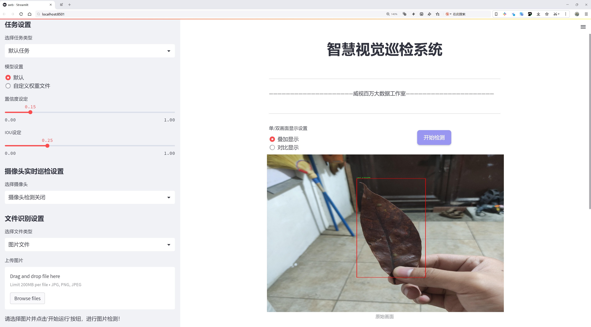
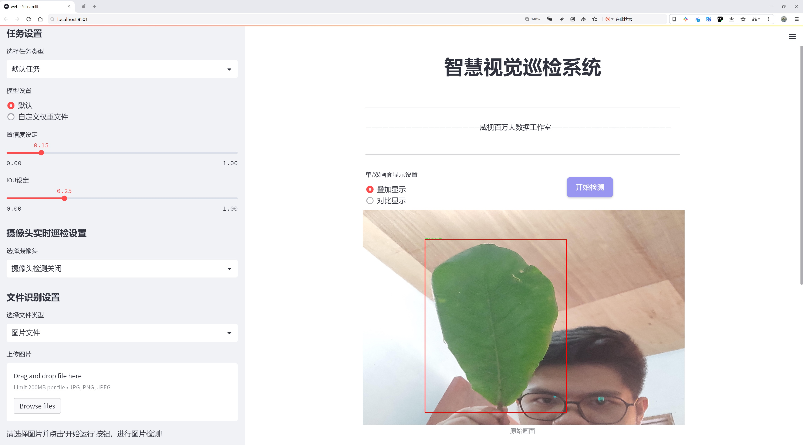
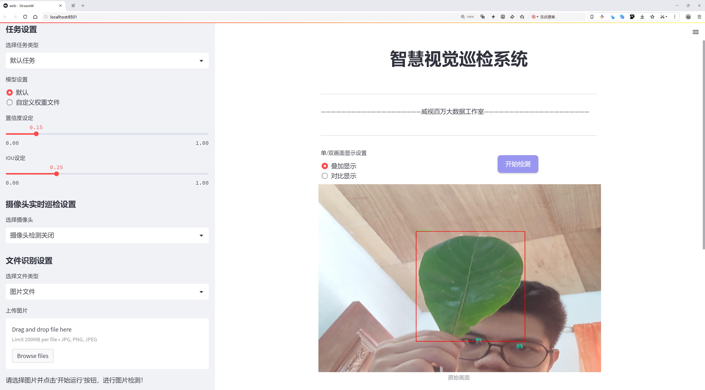
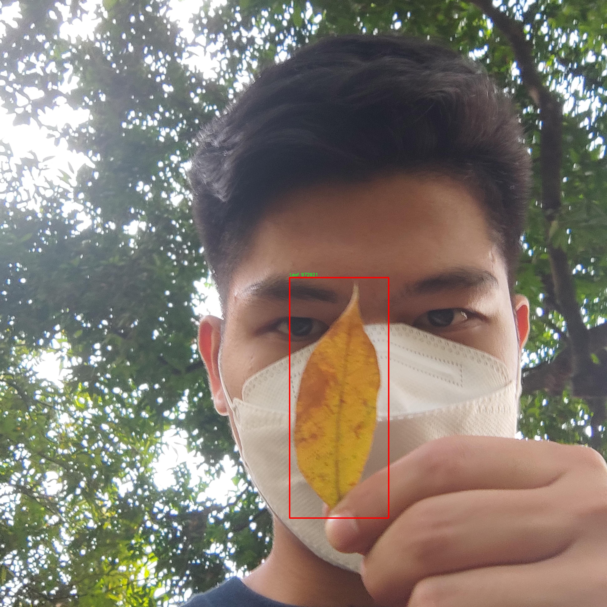
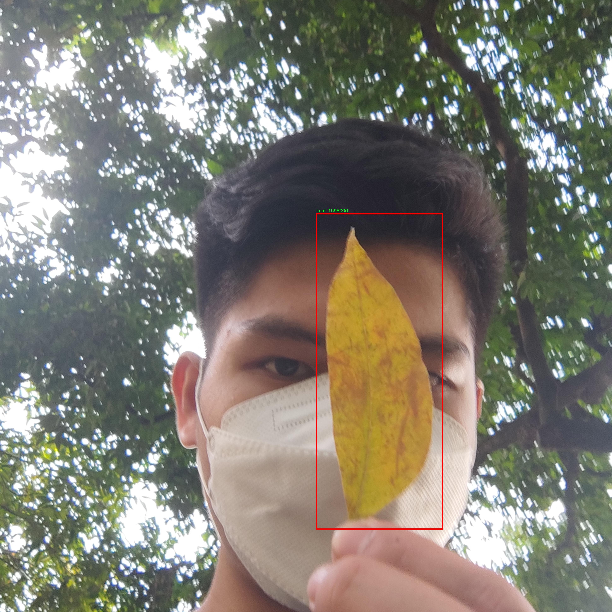
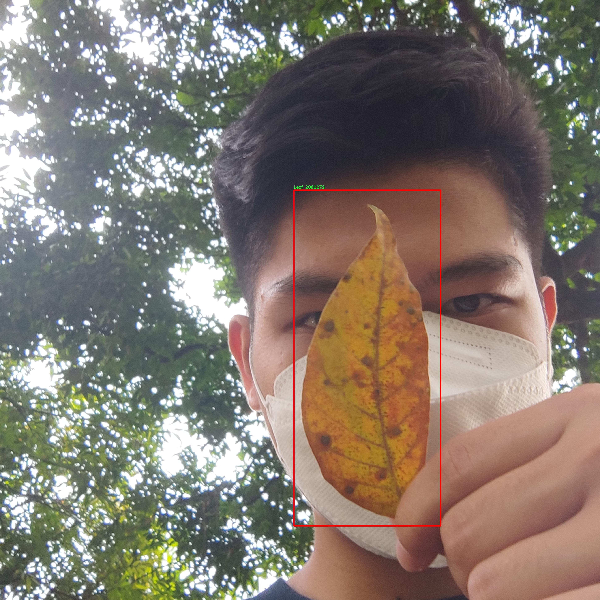
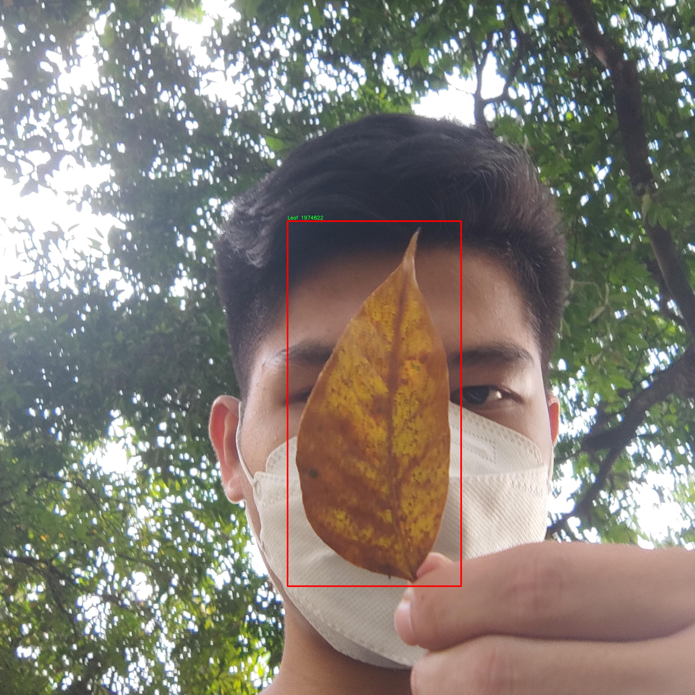
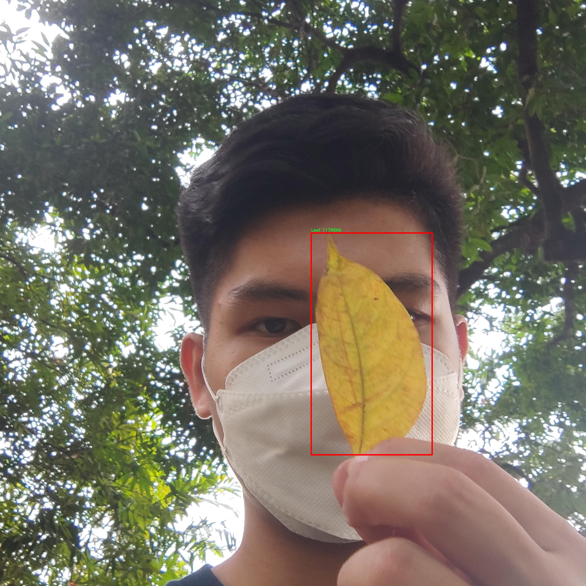

# 叶片检测检测系统源码分享
 # [一条龙教学YOLOV8标注好的数据集一键训练_70+全套改进创新点发刊_Web前端展示]

### 1.研究背景与意义

项目参考[AAAI Association for the Advancement of Artificial Intelligence](https://gitee.com/qunshansj/projects)

项目来源[AACV Association for the Advancement of Computer Vision](https://gitee.com/qunmasj/projects)

研究背景与意义

随着全球气候变化和环境问题的日益严重，植物健康监测与管理在农业生产和生态保护中显得尤为重要。叶片作为植物进行光合作用的主要器官，其健康状况直接影响植物的生长、产量及生态系统的稳定性。因此，准确、高效地检测和分析叶片的状态，对于实现精准农业、提高作物产量以及保障生态平衡具有重要的现实意义。近年来，计算机视觉技术的迅猛发展为叶片检测提供了新的解决方案，尤其是基于深度学习的目标检测算法在图像识别领域取得了显著的成果。

YOLO（You Only Look Once）系列算法因其高效的实时检测能力和较高的准确率，广泛应用于各种目标检测任务。YOLOv8作为该系列的最新版本，结合了多种先进的深度学习技术，进一步提升了检测精度和速度。然而，尽管YOLOv8在目标检测方面表现出色，但在特定领域，如植物叶片检测中，仍然面临一些挑战。这些挑战主要体现在叶片的多样性、背景复杂性以及光照变化等因素对检测精度的影响。因此，基于改进YOLOv8的叶片检测系统的研究具有重要的理论价值和实际应用意义。

本研究旨在构建一个高效的叶片检测系统，通过对YOLOv8算法进行改进，以提高其在叶片检测任务中的性能。为此，我们将使用一个包含6000张图像的叶片数据集，该数据集专注于单一类别——叶片。这一数据集的规模和专一性为算法的训练和测试提供了丰富的样本，有助于提高模型的泛化能力和检测精度。通过对数据集的深入分析，我们可以识别出影响检测效果的关键因素，并在此基础上对YOLOv8进行针对性的优化。

改进后的YOLOv8模型不仅能够提高叶片的检测准确率，还能在实时监测中保持较高的处理速度，从而满足农业生产中对快速响应的需求。此外，该系统的成功应用将为农业管理提供科学依据，帮助农民及时发现和处理植物病害，减少化肥和农药的使用，提高作物的经济效益和生态效益。

综上所述，基于改进YOLOv8的叶片检测系统的研究，不仅具有重要的学术价值，推动了计算机视觉与农业科学的交叉融合，同时也为实际农业生产提供了切实可行的技术支持，具有广泛的应用前景。通过本研究，我们期望能够为未来的智能农业发展贡献一份力量，助力实现可持续的农业生产模式。

### 2.图片演示







##### 注意：由于此博客编辑较早，上面“2.图片演示”和“3.视频演示”展示的系统图片或者视频可能为老版本，新版本在老版本的基础上升级如下：（实际效果以升级的新版本为准）

  （1）适配了YOLOV8的“目标检测”模型和“实例分割”模型，通过加载相应的权重（.pt）文件即可自适应加载模型。

  （2）支持“图片识别”、“视频识别”、“摄像头实时识别”三种识别模式。

  （3）支持“图片识别”、“视频识别”、“摄像头实时识别”三种识别结果保存导出，解决手动导出（容易卡顿出现爆内存）存在的问题，识别完自动保存结果并导出到tempDir中。

  （4）支持Web前端系统中的标题、背景图等自定义修改，后面提供修改教程。

  另外本项目提供训练的数据集和训练教程,暂不提供权重文件（best.pt）,需要您按照教程进行训练后实现图片演示和Web前端界面演示的效果。

### 3.视频演示

[3.1 视频演示](https://www.bilibili.com/video/BV1qRtHeXE9c/)

### 4.数据集信息展示

##### 4.1 本项目数据集详细数据（类别数＆类别名）

nc: 1
names: ['Leaf']


##### 4.2 本项目数据集信息介绍

数据集信息展示

在本研究中，我们采用了名为“Leaf OD OVERALL”的数据集，以改进YOLOv8的叶片检测系统。该数据集专注于植物叶片的检测，旨在为农业、园艺及生态研究等领域提供强有力的支持。数据集的类别数量为1，具体类别为“Leaf”，这表明该数据集专注于叶片的识别与检测，简化了模型的训练过程，使其能够更高效地学习到叶片的特征。

“Leaf OD OVERALL”数据集的构建过程经过精心设计，确保了数据的多样性和代表性。数据集中包含了不同种类、不同生长阶段以及不同环境条件下的叶片图像，这些图像的采集涵盖了多种植物，确保了模型在实际应用中的广泛适用性。数据集中的图像经过高质量的标注，确保每一张图像中的叶片都被准确地框选和标识，为YOLOv8模型的训练提供了坚实的基础。

在图像处理方面，数据集中的图像分辨率和质量经过严格控制，以保证模型在训练过程中能够获得清晰的特征信息。高质量的图像不仅有助于提高模型的准确性，还能有效减少训练过程中的噪声干扰，从而提升检测效果。此外，数据集还包含了多种光照条件和背景环境的图像，进一步增强了模型的鲁棒性，使其能够在不同的实际应用场景中保持良好的性能。

为了提高模型的泛化能力，数据集在构建过程中还考虑到了数据增强技术的应用。通过对原始图像进行旋转、缩放、翻转及颜色调整等处理，数据集有效地扩展了样本的多样性，使得模型在面对未见过的样本时，能够更好地进行识别和检测。这种数据增强策略不仅提升了模型的学习效果，也为实际应用中的叶片检测提供了更高的可靠性。

在训练过程中，YOLOv8模型将利用“Leaf OD OVERALL”数据集中的丰富信息，学习到叶片的形状、纹理及颜色等特征。通过对大量样本的反复训练，模型将逐渐优化其参数，提升对叶片的检测精度和召回率。最终，经过多轮迭代和调优，期望模型能够在真实场景中实现高效、准确的叶片检测，助力于农业监测、病虫害识别及植物生长状态评估等多项应用。

综上所述，“Leaf OD OVERALL”数据集为改进YOLOv8的叶片检测系统提供了重要的支持，其精心设计的样本和高质量的标注确保了模型训练的有效性和准确性。通过对该数据集的深入研究与应用，我们期待能够推动植物叶片检测技术的发展，为相关领域的研究和实践提供新的思路和解决方案。











### 5.全套项目环境部署视频教程（零基础手把手教学）

[5.1 环境部署教程链接（零基础手把手教学）](https://www.ixigua.com/7404473917358506534?logTag=c807d0cbc21c0ef59de5)


[5.2 安装Python虚拟环境创建和依赖库安装视频教程链接（零基础手把手教学）](https://www.ixigua.com/7404474678003106304?logTag=1f1041108cd1f708b01a)

### 6.手把手YOLOV8训练视频教程（零基础小白有手就能学会）

[6.1 手把手YOLOV8训练视频教程（零基础小白有手就能学会）](https://www.ixigua.com/7404477157818401292?logTag=d31a2dfd1983c9668658)

### 7.70+种全套YOLOV8创新点代码加载调参视频教程（一键加载写好的改进模型的配置文件）

[7.1 70+种全套YOLOV8创新点代码加载调参视频教程（一键加载写好的改进模型的配置文件）](https://www.ixigua.com/7404478314661806627?logTag=29066f8288e3f4eea3a4)

### 8.70+种全套YOLOV8创新点原理讲解（非科班也可以轻松写刊发刊，V10版本正在科研待更新）

由于篇幅限制，每个创新点的具体原理讲解就不一一展开，具体见下列网址中的创新点对应子项目的技术原理博客网址【Blog】：


[8.1 70+种全套YOLOV8创新点原理讲解链接](https://gitee.com/qunmasj/good)

### 9.系统功能展示（检测对象为举例，实际内容以本项目数据集为准）

图9.1.系统支持检测结果表格显示

  图9.2.系统支持置信度和IOU阈值手动调节

  图9.3.系统支持自定义加载权重文件best.pt(需要你通过步骤5中训练获得)

  图9.4.系统支持摄像头实时识别

  图9.5.系统支持图片识别

  图9.6.系统支持视频识别

  图9.7.系统支持识别结果文件自动保存

  图9.8.系统支持Excel导出检测结果数据


### 10.原始YOLOV8算法原理

原始YOLOv8算法原理

YOLOv8模型是由Ultralytics团队于2023年1月推出的，作为YOLO系列中的最新版本，它在目标检测领域中展现了卓越的性能和灵活性。YOLOv8的设计灵感来源于前几代YOLO模型，尤其是YOLOv5，吸收了近两年半内在实际应用中验证的各种改进。与以往的YOLO系列模型相似，YOLOv8提供了多种尺寸的模型，以适应不同的应用场景和计算资源需求。

在YOLOv8的网络结构中，输入层经过了一系列的预处理步骤，包括Mosaic数据增强、自适应图片缩放和灰度填充等。这些步骤旨在提高模型的鲁棒性和泛化能力。然而，YOLOv8在训练的最后10个epoch中停止使用Mosaic数据增强，以避免破坏数据的真实分布，确保模型能够学习到更有用的信息。

YOLOv8的主干网络结构在保留YOLOv5设计思想的基础上进行了重要的创新。首先，YOLOv8将C3模块替换为C2f模块，这一变化引入了YOLOv7中的ELAN（Efficient Layer Aggregation Network）思路，增加了更多的跳层连接，从而增强了梯度流的丰富性。C2f模块的设计不仅保持了模型的轻量化，还提高了特征提取的效率。此外，YOLOv8依然保留了SPPF（Spatial Pyramid Pooling Fast）模块，尽管效果不变，但其执行时间得到了显著减少。

在颈部网络（Neck）中，YOLOv8同样将所有的C3模块更改为C2f模块，并删除了两处上采样之前的卷积连接层，这一设计进一步简化了网络结构，提高了特征融合的效率。YOLOv8的头部网络则采用了YOLOX中引入的解耦头（Decoupled Head）设计，分别通过两条并行的分支提取类别和位置特征。这种设计的优势在于，分类任务更关注特征图中提取到的特征与已有类别的相似性，而定位任务则关注边界框与真实框之间的位置关系。由于这两者的侧重点不同，使用两个检测头的方式使得模型在收敛速度和预测精度上都有了显著提升。

YOLOv8的另一个重要创新是采用了无锚框（Anchor-Free）结构，这一结构使得模型能够直接预测目标的中心位置，省去了传统锚框方法中的复杂性。为了进一步提升模型的性能，YOLOv8引入了任务对齐学习（Task Alignment Learning，TAL）机制，以区分正负样本，并通过分类分数和IOU（Intersection over Union）的高次幂乘积作为衡量任务对齐程度的指标。这一机制的引入，使得模型在分类和定位的损失函数中都能够更好地反映出模型的整体性能。

在模型的检测结果上，YOLOv8在COCO数据集上表现出色，展现了较高的mAP（mean Average Precision）值，尤其是在相同尺寸的模型中，YOLOv8的参数量并没有显著增加，但精度却优于其他模型。此外，YOLOv8在推理速度上也有了显著提升，能够满足实时目标检测的需求。

YOLOv8的设计不仅考虑到了精度和速度的平衡，还特别关注了模型的易用性和工程化特性。这使得YOLOv8在各种硬件平台上均能高效运行，从CPU到GPU都能实现良好的性能表现。该模型的创新点包括新的骨干网络、无锚检测头和新的损失函数，这些变化共同推动了YOLOv8在目标检测任务中的广泛应用。

综上所述，YOLOv8作为YOLO系列的最新进展，融合了多种先进的技术和设计理念，极大地提升了目标检测的精度和速度。它不仅在理论上具有重要的研究价值，也在实际应用中展现了广泛的应用潜力，尤其是在需要实时性和准确性的任务中，如机器人垃圾分拣系统等场景。随着YOLOv8的不断发展和优化，未来的目标检测技术将更加高效和智能。


### 11.项目核心源码讲解（再也不用担心看不懂代码逻辑）

#### 11.1 70+种YOLOv8算法改进源码大全和调试加载训练教程（非必要）\ultralytics\nn\modules\head.py

以下是对给定代码的核心部分进行提炼和详细注释的结果。主要保留了YOLOv8模型的检测头、分割头、姿态估计头、分类头和RTDETR解码器的核心实现。

```python
import torch
import torch.nn as nn
from .block import DFL, Proto
from .conv import Conv
from .transformer import MLP, DeformableTransformerDecoder, DeformableTransformerDecoderLayer

class Detect(nn.Module):
    """YOLOv8 检测头，用于目标检测模型。"""
    
    def __init__(self, nc=80, ch=()):
        """初始化 YOLOv8 检测层，指定类别数和通道数。"""
        super().__init__()
        self.nc = nc  # 类别数
        self.nl = len(ch)  # 检测层数
        self.reg_max = 16  # DFL 通道数
        self.no = nc + self.reg_max * 4  # 每个锚点的输出数量
        self.stride = torch.zeros(self.nl)  # 在构建时计算的步幅
        c2, c3 = max((16, ch[0] // 4, self.reg_max * 4)), max(ch[0], min(self.nc, 100))  # 通道数
        # 定义用于边界框回归的卷积层
        self.cv2 = nn.ModuleList(
            nn.Sequential(Conv(x, c2, 3), Conv(c2, c2, 3), nn.Conv2d(c2, 4 * self.reg_max, 1)) for x in ch)
        # 定义用于分类的卷积层
        self.cv3 = nn.ModuleList(nn.Sequential(Conv(x, c3, 3), Conv(c3, c3, 3), nn.Conv2d(c3, self.nc, 1)) for x in ch)
        self.dfl = DFL(self.reg_max) if self.reg_max > 1 else nn.Identity()  # DFL层

    def forward(self, x):
        """连接并返回预测的边界框和类别概率。"""
        shape = x[0].shape  # BCHW
        for i in range(self.nl):
            x[i] = torch.cat((self.cv2[i](x[i]), self.cv3[i](x[i])), 1)  # 连接边界框和分类输出
        if self.training:
            return x
        # 动态生成锚点
        self.anchors, self.strides = (x.transpose(0, 1) for x in make_anchors(x, self.stride, 0.5))
        x_cat = torch.cat([xi.view(shape[0], self.no, -1) for xi in x], 2)  # 合并所有层的输出
        box, cls = x_cat.split((self.reg_max * 4, self.nc), 1)  # 分割边界框和类别
        dbox = dist2bbox(self.dfl(box), self.anchors.unsqueeze(0), xywh=True, dim=1) * self.strides  # 计算最终边界框
        y = torch.cat((dbox, cls.sigmoid()), 1)  # 合并边界框和类别概率
        return y

class Segment(Detect):
    """YOLOv8 分割头，用于分割模型。"""

    def __init__(self, nc=80, nm=32, npr=256, ch=()):
        """初始化 YOLO 模型属性，如掩码数、原型数和卷积层。"""
        super().__init__(nc, ch)
        self.nm = nm  # 掩码数
        self.npr = npr  # 原型数
        self.proto = Proto(ch[0], self.npr, self.nm)  # 原型
        self.detect = Detect.forward

        c4 = max(ch[0] // 4, self.nm)
        self.cv4 = nn.ModuleList(nn.Sequential(Conv(x, c4, 3), Conv(c4, c4, 3), nn.Conv2d(c4, self.nm, 1)) for x in ch)

    def forward(self, x):
        """返回模型输出和掩码系数。"""
        p = self.proto(x[0])  # 掩码原型
        bs = p.shape[0]  # 批量大小
        mc = torch.cat([self.cv4[i](x[i]).view(bs, self.nm, -1) for i in range(self.nl)], 2)  # 掩码系数
        x = self.detect(self, x)
        return (torch.cat([x[0], mc], 1), p) if self.export else (torch.cat([x[0], mc], 1), (x[1], mc, p))

class Pose(Detect):
    """YOLOv8 姿态估计头，用于关键点模型。"""

    def __init__(self, nc=80, kpt_shape=(17, 3), ch=()):
        """初始化 YOLO 网络，默认参数和卷积层。"""
        super().__init__(nc, ch)
        self.kpt_shape = kpt_shape  # 关键点形状
        self.nk = kpt_shape[0] * kpt_shape[1]  # 关键点总数
        self.detect = Detect.forward

        c4 = max(ch[0] // 4, self.nk)
        self.cv4 = nn.ModuleList(nn.Sequential(Conv(x, c4, 3), Conv(c4, c4, 3), nn.Conv2d(c4, self.nk, 1)) for x in ch)

    def forward(self, x):
        """执行前向传播并返回预测。"""
        bs = x[0].shape[0]  # 批量大小
        kpt = torch.cat([self.cv4[i](x[i]).view(bs, self.nk, -1) for i in range(self.nl)], -1)  # 关键点
        x = self.detect(self, x)
        pred_kpt = self.kpts_decode(bs, kpt)  # 解码关键点
        return torch.cat([x, pred_kpt], 1) if self.export else (torch.cat([x[0], pred_kpt], 1), (x[1], kpt))

class Classify(nn.Module):
    """YOLOv8 分类头，将输入转换为类别预测。"""

    def __init__(self, c1, c2, k=1, s=1, p=None, g=1):
        """初始化 YOLOv8 分类头，指定输入和输出通道、卷积核大小、步幅等。"""
        super().__init__()
        c_ = 1280  # EfficientNet-B0 的大小
        self.conv = Conv(c1, c_, k, s, p, g)
        self.pool = nn.AdaptiveAvgPool2d(1)  # 池化到 x(b,c_,1,1)
        self.drop = nn.Dropout(p=0.0, inplace=True)
        self.linear = nn.Linear(c_, c2)  # 转换到 x(b,c2)

    def forward(self, x):
        """执行前向传播，返回分类结果。"""
        if isinstance(x, list):
            x = torch.cat(x, 1)
        x = self.linear(self.drop(self.pool(self.conv(x)).flatten(1)))
        return x if self.training else x.softmax(1)

class RTDETRDecoder(nn.Module):
    """实时可变形变换解码器模块，用于目标检测。"""

    def __init__(self, nc=80, ch=(512, 1024, 2048), hd=256, nq=300, ndp=4, nh=8, ndl=6, d_ffn=1024, dropout=0.):
        """初始化 RTDETR 解码器模块，指定参数。"""
        super().__init__()
        self.hidden_dim = hd
        self.nhead = nh
        self.nl = len(ch)  # 层数
        self.nc = nc
        self.num_queries = nq
        self.num_decoder_layers = ndl

        # 特征投影
        self.input_proj = nn.ModuleList(nn.Sequential(nn.Conv2d(x, hd, 1, bias=False), nn.BatchNorm2d(hd)) for x in ch)

        # 变换器模块
        decoder_layer = DeformableTransformerDecoderLayer(hd, nh, d_ffn, dropout)
        self.decoder = DeformableTransformerDecoder(hd, decoder_layer, ndl)

        # 解码器头
        self.dec_score_head = nn.ModuleList([nn.Linear(hd, nc) for _ in range(ndl)])
        self.dec_bbox_head = nn.ModuleList([MLP(hd, hd, 4, num_layers=3) for _ in range(ndl)])

    def forward(self, x, batch=None):
        """执行前向传播，返回边界框和分类分数。"""
        feats, shapes = self._get_encoder_input(x)  # 获取编码器输入
        # 解码器
        dec_bboxes, dec_scores = self.decoder(feats, shapes, self.dec_bbox_head, self.dec_score_head)
        # 合并输出
        y = torch.cat((dec_bboxes.squeeze(0), dec_scores.squeeze(0).sigmoid()), -1)
        return y

    def _get_encoder_input(self, x):
        """处理并返回编码器输入。"""
        x = [self.input_proj[i](feat) for i, feat in enumerate(x)]  # 投影特征
        feats = torch.cat([feat.flatten(2).permute(0, 2, 1) for feat in x], 1)  # 合并特征
        return feats
```

### 代码说明
1. **Detect 类**：实现了 YOLOv8 的检测头，负责生成边界框和类别概率。
2. **Segment 类**：继承自 Detect 类，添加了对分割的支持，生成掩码原型和掩码系数。
3. **Pose 类**：同样继承自 Detect 类，专注于关键点检测，解码关键点位置。
4. **Classify 类**：实现了分类头，将特征映射到类别。
5. **RTDETRDecoder 类**：实现了实时可变形变换解码器，负责将编码器的输出转换为最终的边界框和分类分数。

每个类和方法都有详细的中文注释，便于理解其功能和实现细节。

这个文件是Ultralytics YOLOv8模型的头部模块，主要负责目标检测、分割、姿态估计和分类等任务的实现。文件中定义了多个类，每个类对应不同的功能模块。

首先，`Detect`类是YOLOv8的检测头，负责处理目标检测任务。它的构造函数接收类别数量和通道数作为参数，并初始化了一些关键参数，如输出数量、锚框和步幅。`forward`方法用于前向传播，处理输入数据并返回预测的边界框和类别概率。在训练模式下，它返回原始的输出；在推理模式下，它会根据输入的形状动态生成锚框，并计算最终的边界框和类别概率。

接下来是`Segment`类，它继承自`Detect`类，专门用于图像分割任务。它在构造函数中增加了对掩膜数量和原型数量的支持，并定义了相应的卷积层。在`forward`方法中，它除了返回检测结果外，还返回掩膜系数和原型。

`Pose`类同样继承自`Detect`，用于姿态估计任务。它的构造函数中定义了关键点的形状，并在`forward`方法中处理输入数据，返回检测结果和关键点预测。

`Classify`类则是YOLOv8的分类头，负责将输入图像分类。它通过卷积层、池化层和线性层来处理输入，并在前向传播中返回分类结果。

最后，`RTDETRDecoder`类实现了实时可变形Transformer解码器，结合了Transformer架构和可变形卷积，能够预测图像中的边界框和类别标签。它的构造函数中定义了多个参数，包括隐藏层维度、查询数量和解码层数量等。在`forward`方法中，它处理输入特征并生成最终的预测结果。

整个文件通过定义这些类，提供了YOLOv8模型的不同功能模块，便于在目标检测、分割、姿态估计和分类等任务中使用。每个模块都具有清晰的职责和结构，使得模型的扩展和调试变得更加高效。

#### 11.2 70+种YOLOv8算法改进源码大全和调试加载训练教程（非必要）\ultralytics\models\sam\modules\encoders.py

以下是经过简化并添加详细中文注释的核心代码部分：

```python
import torch
import torch.nn as nn
import torch.nn.functional as F

class ImageEncoderViT(nn.Module):
    """
    使用视觉变换器（ViT）架构的图像编码器，将图像编码为紧凑的潜在空间。
    编码器将图像分割为补丁，并通过一系列变换块处理这些补丁。
    最终的编码表示通过一个颈部模块生成。
    """

    def __init__(self, img_size: int = 1024, patch_size: int = 16, embed_dim: int = 768, depth: int = 12, out_chans: int = 256) -> None:
        """
        初始化图像编码器的参数。

        Args:
            img_size (int): 输入图像的大小（假设为正方形）。
            patch_size (int): 补丁的大小。
            embed_dim (int): 补丁嵌入的维度。
            depth (int): ViT的深度（变换块的数量）。
            out_chans (int): 输出通道数。
        """
        super().__init__()
        self.img_size = img_size

        # 补丁嵌入模块，将图像分割为补丁并进行嵌入
        self.patch_embed = PatchEmbed(
            kernel_size=(patch_size, patch_size),
            stride=(patch_size, patch_size),
            in_chans=3,  # 输入图像通道数
            embed_dim=embed_dim,
        )

        # 变换块列表
        self.blocks = nn.ModuleList()
        for _ in range(depth):
            block = Block(dim=embed_dim)
            self.blocks.append(block)

        # 颈部模块，进一步处理输出
        self.neck = nn.Sequential(
            nn.Conv2d(embed_dim, out_chans, kernel_size=1, bias=False),
            nn.LayerNorm(out_chans),
            nn.Conv2d(out_chans, out_chans, kernel_size=3, padding=1, bias=False),
            nn.LayerNorm(out_chans),
        )

    def forward(self, x: torch.Tensor) -> torch.Tensor:
        """通过补丁嵌入、变换块和颈部模块处理输入。"""
        x = self.patch_embed(x)  # 进行补丁嵌入
        for blk in self.blocks:  # 逐个通过变换块
            x = blk(x)
        return self.neck(x.permute(0, 3, 1, 2))  # 调整维度并通过颈部模块


class Block(nn.Module):
    """变换块，包含多头注意力和前馈网络。"""

    def __init__(self, dim: int, num_heads: int = 8) -> None:
        """
        初始化变换块的参数。

        Args:
            dim (int): 输入通道数。
            num_heads (int): 注意力头的数量。
        """
        super().__init__()
        self.norm1 = nn.LayerNorm(dim)  # 归一化层
        self.attn = Attention(dim, num_heads)  # 注意力模块
        self.norm2 = nn.LayerNorm(dim)  # 归一化层
        self.mlp = MLPBlock(embedding_dim=dim)  # 前馈网络模块

    def forward(self, x: torch.Tensor) -> torch.Tensor:
        """执行变换块的前向传播。"""
        shortcut = x  # 残差连接
        x = self.norm1(x)  # 归一化
        x = self.attn(x)  # 注意力计算
        x = shortcut + x  # 残差连接
        return x + self.mlp(self.norm2(x))  # 前馈网络和归一化


class Attention(nn.Module):
    """多头注意力模块。"""

    def __init__(self, dim: int, num_heads: int = 8) -> None:
        """
        初始化注意力模块的参数。

        Args:
            dim (int): 输入通道数。
            num_heads (int): 注意力头的数量。
        """
        super().__init__()
        self.num_heads = num_heads
        self.qkv = nn.Linear(dim, dim * 3)  # 查询、键、值的线性变换
        self.proj = nn.Linear(dim, dim)  # 输出线性变换

    def forward(self, x: torch.Tensor) -> torch.Tensor:
        """执行注意力计算。"""
        B, H, W, _ = x.shape  # 获取输入的批次大小和维度
        qkv = self.qkv(x).reshape(B, H * W, 3, self.num_heads, -1).permute(2, 0, 3, 1, 4)  # 计算q、k、v
        q, k, v = qkv.reshape(3, B * self.num_heads, H * W, -1).unbind(0)  # 分离q、k、v
        attn = (q @ k.transpose(-2, -1))  # 计算注意力分数
        attn = attn.softmax(dim=-1)  # 归一化
        x = (attn @ v).view(B, self.num_heads, H, W, -1).permute(0, 2, 3, 1, 4).reshape(B, H, W, -1)  # 计算输出
        return self.proj(x)  # 线性变换输出
        

class PatchEmbed(nn.Module):
    """图像到补丁嵌入的模块。"""

    def __init__(self, kernel_size: Tuple[int, int] = (16, 16), in_chans: int = 3, embed_dim: int = 768) -> None:
        """
        初始化补丁嵌入模块。

        Args:
            kernel_size (Tuple): 卷积核大小。
            in_chans (int): 输入图像通道数。
            embed_dim (int): 补丁嵌入维度。
        """
        super().__init__()
        self.proj = nn.Conv2d(in_chans, embed_dim, kernel_size=kernel_size)  # 卷积层用于补丁嵌入

    def forward(self, x: torch.Tensor) -> torch.Tensor:
        """计算补丁嵌入。"""
        return self.proj(x).permute(0, 2, 3, 1)  # 调整维度
```

### 代码说明
1. **ImageEncoderViT**: 这是一个图像编码器，使用ViT架构将输入图像编码为潜在空间。它将图像分割为补丁，并通过多个变换块处理这些补丁，最后通过颈部模块生成输出。

2. **Block**: 变换块的实现，包含多头注意力机制和前馈网络。它使用残差连接和归一化层来增强训练效果。

3. **Attention**: 多头注意力模块，负责计算输入的注意力分数并生成输出。

4. **PatchEmbed**: 将输入图像分割为补丁并进行嵌入的模块，使用卷积层来实现。

这些核心部分是实现图像编码的基础，能够有效地将图像信息转化为可用于后续处理的特征表示。

这个程序文件是一个实现了图像编码器和提示编码器的PyTorch模块，主要用于YOLOv8算法中的图像处理和特征提取。代码中包含了多个类，分别负责不同的功能。

首先，`ImageEncoderViT`类实现了一个基于视觉变换器（ViT）架构的图像编码器。它的主要任务是将输入图像编码为一个紧凑的潜在空间表示。该编码器将图像分割成多个小块（patches），并通过一系列的变换块（transformer blocks）处理这些小块。类的构造函数中定义了多个参数，包括输入图像的大小、每个小块的大小、嵌入维度、变换块的深度等。构造函数还初始化了小块嵌入模块、位置嵌入、变换块列表以及后续处理的颈部模块（neck）。在前向传播中，输入图像首先经过小块嵌入，然后加上位置嵌入，接着通过所有变换块，最后通过颈部模块生成最终的编码表示。

接下来，`PromptEncoder`类用于编码不同类型的提示，包括点、框和掩码，以便输入到SAM的掩码解码器。该类的构造函数定义了嵌入维度、输入图像大小、图像嵌入大小等参数，并初始化了用于随机位置嵌入的模块、点嵌入、掩码处理网络等。在前向传播中，该类根据输入的点、框和掩码生成稀疏和密集的嵌入表示。

`PositionEmbeddingRandom`类实现了基于随机空间频率的位置信息编码。它的构造函数中定义了位置编码的参数，并在前向传播中生成指定大小的网格的位置信息编码。

`Block`类实现了支持窗口注意力和残差传播的变换块。它包含了标准的归一化层、注意力机制和多层感知机（MLP）模块。在前向传播中，输入首先经过归一化，然后进行窗口分区，接着通过注意力机制处理，最后通过MLP模块和残差连接生成输出。

`Attention`类实现了多头注意力机制，支持相对位置嵌入。它的前向传播方法计算查询、键和值的线性变换，并根据需要添加相对位置嵌入。

此外，代码中还定义了一些辅助函数，如`window_partition`和`window_unpartition`，用于处理窗口分区和反分区操作，以及`get_rel_pos`和`add_decomposed_rel_pos`函数，用于处理相对位置嵌入。

最后，`PatchEmbed`类实现了图像到小块嵌入的转换，通过卷积操作将输入图像转换为小块嵌入。这个模块在图像编码器中起到了关键作用。

整体来看，这个程序文件提供了YOLOv8算法中图像处理和特征提取的核心模块，利用现代深度学习技术（如变换器和注意力机制）来提升图像理解能力。

#### 11.3 ui.py

以下是经过简化和注释的核心代码部分：

```python
import sys
import subprocess

def run_script(script_path):
    """
    使用当前 Python 环境运行指定的脚本。

    Args:
        script_path (str): 要运行的脚本路径

    Returns:
        None
    """
    # 获取当前 Python 解释器的路径
    python_path = sys.executable

    # 构建运行命令，使用 streamlit 运行指定的脚本
    command = f'"{python_path}" -m streamlit run "{script_path}"'

    # 执行命令，并等待其完成
    result = subprocess.run(command, shell=True)
    
    # 检查命令执行结果，如果返回码不为0，表示出错
    if result.returncode != 0:
        print("脚本运行出错。")

# 实例化并运行应用
if __name__ == "__main__":
    # 指定要运行的脚本路径
    script_path = "web.py"  # 这里可以直接使用脚本名，假设它在当前目录

    # 调用函数运行脚本
    run_script(script_path)
```

### 代码注释说明：
1. **导入模块**：
   - `sys`：用于获取当前 Python 解释器的路径。
   - `subprocess`：用于执行外部命令。

2. **`run_script` 函数**：
   - 该函数接收一个脚本路径作为参数，并使用当前 Python 环境运行该脚本。
   - 使用 `sys.executable` 获取当前 Python 解释器的路径。
   - 构建一个命令字符串，使用 `streamlit` 运行指定的脚本。
   - 使用 `subprocess.run` 执行命令，并等待其完成。
   - 检查命令的返回码，如果不为0，则输出错误信息。

3. **主程序块**：
   - 在脚本作为主程序运行时，指定要运行的脚本路径（这里假设脚本在当前目录）。
   - 调用 `run_script` 函数来执行指定的脚本。

这个程序文件名为 `ui.py`，主要功能是通过当前的 Python 环境来运行一个指定的脚本。代码中首先导入了必要的模块，包括 `sys`、`os` 和 `subprocess`，以及一个自定义的路径处理模块 `abs_path`。

在 `run_script` 函数中，首先获取当前 Python 解释器的路径，这样可以确保使用正确的 Python 环境来执行脚本。接着，构建一个命令字符串，该命令用于调用 `streamlit` 模块并运行指定的脚本。这里使用了 `subprocess.run` 方法来执行这个命令，`shell=True` 选项允许在 shell 中执行命令。

如果脚本运行过程中出现错误，函数会检查返回码，如果返回码不为零，则打印出错信息。

在文件的主程序部分，首先通过 `abs_path` 函数指定要运行的脚本路径，这里是 `web.py`。然后调用 `run_script` 函数来执行这个脚本。

整体来看，这个程序的目的是提供一个简单的接口来运行一个 Streamlit 应用，确保使用当前的 Python 环境，并处理可能出现的错误。

#### 11.4 code\ultralytics\models\yolo\obb\train.py

以下是代码中最核心的部分，并附上详细的中文注释：

```python
# 导入必要的模块
from ultralytics.models import yolo
from ultralytics.nn.tasks import OBBModel
from ultralytics.utils import DEFAULT_CFG, RANK

class OBBTrainer(yolo.detect.DetectionTrainer):
    """
    OBBTrainer类，继承自DetectionTrainer类，用于基于定向边界框（OBB）模型的训练。
    """

    def __init__(self, cfg=DEFAULT_CFG, overrides=None, _callbacks=None):
        """初始化OBBTrainer对象，接受配置和重写参数。"""
        if overrides is None:
            overrides = {}
        # 设置任务类型为"obb"
        overrides["task"] = "obb"
        # 调用父类的初始化方法
        super().__init__(cfg, overrides, _callbacks)

    def get_model(self, cfg=None, weights=None, verbose=True):
        """返回根据指定配置和权重初始化的OBBModel模型。"""
        # 创建OBBModel实例，ch表示输入通道数，nc表示类别数
        model = OBBModel(cfg, ch=3, nc=self.data["nc"], verbose=verbose and RANK == -1)
        # 如果提供了权重，则加载权重
        if weights:
            model.load(weights)

        return model

    def get_validator(self):
        """返回OBBValidator实例，用于YOLO模型的验证。"""
        # 定义损失名称
        self.loss_names = "box_loss", "cls_loss", "dfl_loss"
        # 返回OBBValidator实例
        return yolo.obb.OBBValidator(self.test_loader, save_dir=self.save_dir, args=copy(self.args))
```

### 代码核心部分解释：
1. **OBBTrainer类**：这是一个用于训练定向边界框（OBB）模型的类，继承自YOLO的检测训练器（DetectionTrainer）。
2. **初始化方法**：在初始化时，设置任务类型为"obb"，并调用父类的初始化方法以确保基类的属性和方法被正确设置。
3. **get_model方法**：用于创建和返回一个OBBModel实例，允许根据配置和权重初始化模型。
4. **get_validator方法**：返回一个OBBValidator实例，用于验证模型的性能，并定义了损失名称，以便在训练过程中进行监控。

这个程序文件定义了一个名为 `OBBTrainer` 的类，继承自 `yolo.detect.DetectionTrainer`，用于基于定向边界框（Oriented Bounding Box, OBB）模型的训练。首先，文件引入了一些必要的模块和类，包括 `copy` 模块、`yolo` 模块中的内容、`OBBModel` 类以及一些工具函数。

在 `OBBTrainer` 类的文档字符串中，提供了一个使用示例，展示了如何实例化 `OBBTrainer` 并调用其 `train` 方法进行训练。示例中，用户可以传入模型文件、数据集配置文件和训练的轮数等参数。

类的构造函数 `__init__` 接受三个参数：`cfg`（配置），`overrides`（覆盖参数），和 `_callbacks`（回调函数）。如果没有提供 `overrides`，则初始化为空字典。接着，将任务类型设置为 "obb"，并调用父类的构造函数进行初始化。

`get_model` 方法用于返回一个初始化的 `OBBModel` 实例。该方法接受配置文件和权重文件作为参数。如果提供了权重文件，则会加载这些权重。该方法还会根据传入的参数设置模型的输出通道数和类别数，并在需要时打印详细信息。

`get_validator` 方法返回一个 `OBBValidator` 实例，用于对 YOLO 模型进行验证。在这个方法中，定义了损失名称，包括边界框损失、分类损失和分布式焦点损失。最后，它会创建并返回一个 `OBBValidator` 对象，传入测试数据加载器、保存目录和参数的副本。

整体来看，这个文件的主要功能是定义一个用于训练 OBB 模型的训练器类，提供了模型初始化和验证的相关方法，方便用户进行模型训练和评估。

#### 11.5 code\ultralytics\models\utils\ops.py

以下是代码中最核心的部分，并附上详细的中文注释：

```python
import torch
import torch.nn as nn
import torch.nn.functional as F
from scipy.optimize import linear_sum_assignment
from ultralytics.utils.metrics import bbox_iou

class HungarianMatcher(nn.Module):
    """
    实现匈牙利匹配器的模块，用于在端到端的方式中解决分配问题。
    匈牙利匹配器通过考虑分类分数、边界框坐标等成本函数，在预测的边界框和真实边界框之间执行最优分配。
    """

    def __init__(self, cost_gain=None, use_fl=True, with_mask=False, num_sample_points=12544, alpha=0.25, gamma=2.0):
        """初始化匈牙利匹配器，设置成本系数、焦点损失、掩码预测、样本点和alpha、gamma因子。"""
        super().__init__()
        if cost_gain is None:
            cost_gain = {"class": 1, "bbox": 5, "giou": 2, "mask": 1, "dice": 1}
        self.cost_gain = cost_gain  # 成本系数
        self.use_fl = use_fl  # 是否使用焦点损失
        self.with_mask = with_mask  # 是否使用掩码预测
        self.num_sample_points = num_sample_points  # 掩码成本计算的样本点数量
        self.alpha = alpha  # 焦点损失中的alpha因子
        self.gamma = gamma  # 焦点损失中的gamma因子

    def forward(self, pred_bboxes, pred_scores, gt_bboxes, gt_cls, gt_groups, masks=None, gt_mask=None):
        """
        前向传播，计算预测和真实值之间的成本（分类成本、边界框L1成本和GIoU成本），
        并根据这些成本找到预测和真实值之间的最优匹配。
        """
        bs, nq, nc = pred_scores.shape  # 批大小、查询数量、类别数量

        if sum(gt_groups) == 0:  # 如果没有真实目标
            return [(torch.tensor([], dtype=torch.long), torch.tensor([], dtype=torch.long)) for _ in range(bs)]

        # 将预测分数展平以计算成本矩阵
        pred_scores = pred_scores.detach().view(-1, nc)
        pred_scores = F.sigmoid(pred_scores) if self.use_fl else F.softmax(pred_scores, dim=-1)
        pred_bboxes = pred_bboxes.detach().view(-1, 4)

        # 计算分类成本
        pred_scores = pred_scores[:, gt_cls]  # 选择与真实类别对应的预测分数
        if self.use_fl:  # 如果使用焦点损失
            neg_cost_class = (1 - self.alpha) * (pred_scores**self.gamma) * (-(1 - pred_scores + 1e-8).log())
            pos_cost_class = self.alpha * ((1 - pred_scores) ** self.gamma) * (-(pred_scores + 1e-8).log())
            cost_class = pos_cost_class - neg_cost_class  # 计算分类成本
        else:
            cost_class = -pred_scores  # 计算分类成本

        # 计算边界框之间的L1成本
        cost_bbox = (pred_bboxes.unsqueeze(1) - gt_bboxes.unsqueeze(0)).abs().sum(-1)  # (bs*num_queries, num_gt)

        # 计算边界框之间的GIoU成本
        cost_giou = 1.0 - bbox_iou(pred_bboxes.unsqueeze(1), gt_bboxes.unsqueeze(0), xywh=True, GIoU=True).squeeze(-1)

        # 最终成本矩阵
        C = (
            self.cost_gain["class"] * cost_class
            + self.cost_gain["bbox"] * cost_bbox
            + self.cost_gain["giou"] * cost_giou
        )

        # 将无效值（NaNs和无穷大）设置为0
        C[C.isnan() | C.isinf()] = 0.0

        C = C.view(bs, nq, -1).cpu()  # 重新调整成本矩阵形状
        indices = [linear_sum_assignment(c[i]) for i, c in enumerate(C.split(gt_groups, -1))]  # 进行匈牙利匹配
        gt_groups = torch.as_tensor([0, *gt_groups[:-1]]).cumsum_(0)  # 计算真实目标的索引
        return [
            (torch.tensor(i, dtype=torch.long), torch.tensor(j, dtype=torch.long) + gt_groups[k])
            for k, (i, j) in enumerate(indices)
        ]
```

### 代码说明：
1. **HungarianMatcher类**：实现了匈牙利算法，用于在预测边界框和真实边界框之间进行最优匹配。
2. **__init__方法**：初始化成本系数、是否使用焦点损失、是否使用掩码预测等参数。
3. **forward方法**：计算预测和真实值之间的成本，并找到最优匹配。
   - **成本计算**：包括分类成本、边界框L1成本和GIoU成本。
   - **成本矩阵处理**：将无效值处理为0，并进行匈牙利匹配，返回匹配的索引。

这段代码的核心在于通过定义的成本函数来实现预测框与真实框之间的最佳匹配，为目标检测任务提供支持。

这个程序文件定义了一个名为 `HungarianMatcher` 的类，用于实现匈牙利算法（Hungarian Algorithm），用于解决目标检测中的分配问题。该类继承自 PyTorch 的 `nn.Module`，并提供了一种可微分的方式来计算预测框与真实框之间的最佳匹配。

在初始化方法中，`HungarianMatcher` 接受多个参数，包括成本系数、是否使用焦点损失（Focal Loss）、是否进行掩码预测、样本点数量以及焦点损失的两个超参数（alpha 和 gamma）。如果未提供成本系数，则使用默认值。

`forward` 方法是该类的核心功能，接受预测的边界框、预测的分类分数、真实的边界框、真实的类别、真实的组信息以及可选的掩码参数。该方法首先处理输入数据，计算分类成本、边界框之间的 L1 成本和 GIoU 成本，并将这些成本结合起来形成最终的成本矩阵。然后，它使用匈牙利算法找到最佳匹配，并返回每个批次中选择的预测和真实目标的索引。

如果模型支持掩码预测，`_cost_mask` 方法会计算掩码成本和 Dice 成本，但该方法在代码中被注释掉，表明它可能是为未来的模型准备的。

此外，文件中还定义了一个 `get_cdn_group` 函数，用于生成对比去噪训练组。该函数从真实目标中创建正负样本，并对类别标签和边界框坐标应用噪声。函数接受多个参数，包括批次数据、类别数量、查询数量、类别嵌入、去噪数量、类别噪声比例和边界框噪声比例。它返回修改后的类别嵌入、边界框、注意力掩码和元信息。

总的来说，这个文件的主要功能是实现目标检测中的匹配算法和生成对比去噪训练数据，为后续的模型训练提供支持。

#### 11.6 train.py

以下是经过简化和注释的核心代码部分，主要关注于YOLO检测模型的训练过程。

```python
import random
import numpy as np
import torch.nn as nn
from ultralytics.data import build_dataloader, build_yolo_dataset
from ultralytics.engine.trainer import BaseTrainer
from ultralytics.models import yolo
from ultralytics.nn.tasks import DetectionModel
from ultralytics.utils import LOGGER, RANK
from ultralytics.utils.torch_utils import de_parallel, torch_distributed_zero_first

class DetectionTrainer(BaseTrainer):
    """
    扩展自BaseTrainer类，用于基于检测模型的训练。
    """

    def build_dataset(self, img_path, mode="train", batch=None):
        """
        构建YOLO数据集。

        参数:
            img_path (str): 包含图像的文件夹路径。
            mode (str): 模式，`train`或`val`，用户可以为每种模式自定义不同的增强。
            batch (int, optional): 批量大小，仅用于`rect`模式。默认为None。
        """
        gs = max(int(de_parallel(self.model).stride.max() if self.model else 0), 32)
        return build_yolo_dataset(self.args, img_path, batch, self.data, mode=mode, rect=mode == "val", stride=gs)

    def get_dataloader(self, dataset_path, batch_size=16, rank=0, mode="train"):
        """构造并返回数据加载器。"""
        assert mode in ["train", "val"]
        with torch_distributed_zero_first(rank):  # 仅在DDP中初始化数据集*.cache一次
            dataset = self.build_dataset(dataset_path, mode, batch_size)
        shuffle = mode == "train"  # 训练模式下打乱数据
        workers = self.args.workers if mode == "train" else self.args.workers * 2
        return build_dataloader(dataset, batch_size, workers, shuffle, rank)  # 返回数据加载器

    def preprocess_batch(self, batch):
        """对图像批次进行预处理，包括缩放和转换为浮点数。"""
        batch["img"] = batch["img"].to(self.device, non_blocking=True).float() / 255  # 归一化图像
        if self.args.multi_scale:  # 如果启用多尺度
            imgs = batch["img"]
            sz = (
                random.randrange(self.args.imgsz * 0.5, self.args.imgsz * 1.5 + self.stride)
                // self.stride
                * self.stride
            )  # 随机选择尺寸
            sf = sz / max(imgs.shape[2:])  # 计算缩放因子
            if sf != 1:
                ns = [
                    math.ceil(x * sf / self.stride) * self.stride for x in imgs.shape[2:]
                ]  # 计算新的形状
                imgs = nn.functional.interpolate(imgs, size=ns, mode="bilinear", align_corners=False)  # 调整图像大小
            batch["img"] = imgs
        return batch

    def get_model(self, cfg=None, weights=None, verbose=True):
        """返回YOLO检测模型。"""
        model = DetectionModel(cfg, nc=self.data["nc"], verbose=verbose and RANK == -1)
        if weights:
            model.load(weights)  # 加载权重
        return model

    def plot_training_samples(self, batch, ni):
        """绘制带有注释的训练样本。"""
        plot_images(
            images=batch["img"],
            batch_idx=batch["batch_idx"],
            cls=batch["cls"].squeeze(-1),
            bboxes=batch["bboxes"],
            paths=batch["im_file"],
            fname=self.save_dir / f"train_batch{ni}.jpg",
            on_plot=self.on_plot,
        )
```

### 代码注释说明
1. **类定义**：`DetectionTrainer`类继承自`BaseTrainer`，用于YOLO模型的训练。
2. **构建数据集**：`build_dataset`方法根据输入的图像路径和模式构建YOLO数据集，支持训练和验证模式。
3. **获取数据加载器**：`get_dataloader`方法构造数据加载器，支持分布式训练，确保数据集只初始化一次。
4. **预处理批次**：`preprocess_batch`方法对输入的图像批次进行归一化和缩放处理，支持多尺度训练。
5. **获取模型**：`get_model`方法返回YOLO检测模型，并可选择加载预训练权重。
6. **绘制训练样本**：`plot_training_samples`方法用于可视化训练样本及其对应的标签。

通过这些核心部分和注释，可以清晰地理解YOLO模型训练的基本流程和功能。

这个程序文件 `train.py` 是一个用于训练 YOLO（You Only Look Once）目标检测模型的实现，基于 Ultralytics 提供的框架。文件中定义了一个名为 `DetectionTrainer` 的类，继承自 `BaseTrainer`，专门用于处理目标检测任务。

在这个类中，首先导入了一些必要的库和模块，包括数学运算、随机数生成、深度学习相关的库（如 PyTorch）以及 Ultralytics 的数据处理和模型构建模块。接着，类的文档字符串提供了如何使用这个类的示例，展示了如何初始化训练器并开始训练。

`DetectionTrainer` 类中定义了多个方法。`build_dataset` 方法用于构建 YOLO 数据集，接收图像路径、模式（训练或验证）和批次大小作为参数。它会根据模型的步幅（stride）计算合适的图像大小，并调用 `build_yolo_dataset` 函数来创建数据集。

`get_dataloader` 方法用于构建数据加载器，确保在分布式训练时只初始化一次数据集。它根据模式设置是否打乱数据，并调整工作线程的数量。该方法最终返回一个数据加载器，供训练或验证使用。

`preprocess_batch` 方法负责对输入的图像批次进行预处理，包括将图像缩放到合适的大小并转换为浮点数格式。该方法还支持多尺度训练，随机选择图像的大小进行训练，以增强模型的鲁棒性。

`set_model_attributes` 方法用于设置模型的属性，包括类别数量和类别名称。这些信息是从数据集中提取的，确保模型能够正确处理不同的类别。

`get_model` 方法用于返回一个 YOLO 检测模型，支持加载预训练权重。`get_validator` 方法则返回一个用于模型验证的验证器。

`label_loss_items` 方法用于返回带有标签的训练损失项字典，便于在训练过程中监控损失情况。`progress_string` 方法返回一个格式化的字符串，显示训练进度，包括当前的轮次、GPU 内存使用情况和损失值。

`plot_training_samples` 方法用于绘制训练样本及其标注，帮助可视化训练数据。`plot_metrics` 和 `plot_training_labels` 方法则用于绘制训练过程中的指标和标签，便于分析模型的训练效果。

整体来看，这个文件实现了 YOLO 模型训练的核心逻辑，涵盖了数据集构建、数据加载、图像预处理、模型属性设置、损失监控和结果可视化等多个方面，为用户提供了一个完整的训练框架。

### 12.系统整体结构（节选）

### 整体功能和构架概括

该项目是一个完整的目标检测框架，基于 YOLOv8 算法，提供了多种功能模块和工具，以支持模型的训练、验证和推理。项目的核心架构包括以下几个方面：

1. **模型定义与训练**：实现了 YOLOv8 模型的不同变体，包括定向边界框（OBB）模型和姿态估计模型，提供了训练和验证的逻辑。
2. **数据处理**：包含数据集构建、数据加载和预处理的功能，支持多种数据格式和增强技术，以提高模型的鲁棒性。
3. **损失计算与优化**：实现了多种损失函数和优化策略，以便于模型训练的监控和调整。
4. **可视化与调试**：提供了可视化工具，用于绘制训练样本、损失曲线和其他指标，帮助用户理解模型的训练过程。
5. **用户界面**：通过 `ui.py` 提供了一个简单的界面来运行 Streamlit 应用，方便用户进行交互式的模型测试和结果展示。

### 文件功能整理表

| 文件路径                                                                                              | 功能描述                                                                                     |
|------------------------------------------------------------------------------------------------------|----------------------------------------------------------------------------------------------|
| `ultralytics/nn/modules/head.py`                                                                     | 定义 YOLOv8 模型的头部模块，包括目标检测、分割、姿态估计和分类等功能。                               |
| `ultralytics/models/sam/modules/encoders.py`                                                        | 实现图像编码器和提示编码器，主要用于图像特征提取和处理。                                         |
| `ui.py`                                                                                              | 提供一个接口来运行 Streamlit 应用，便于用户进行模型测试和结果展示。                               |
| `code/ultralytics/models/yolo/obb/train.py`                                                         | 定义用于训练定向边界框（OBB）模型的训练器类，处理模型初始化和验证。                              |
| `code/ultralytics/models/utils/ops.py`                                                              | 实现匈牙利算法用于目标检测中的匹配，并生成对比去噪训练数据。                                      |
| `train.py`                                                                                           | 实现 YOLO 模型的训练逻辑，包括数据集构建、数据加载、图像预处理和损失监控等功能。                     |
| `ultralytics/trackers/basetrack.py`                                                                 | 实现基本的目标跟踪算法，提供跟踪目标的功能。                                                   |
| `ultralytics/utils/dist.py`                                                                          | 提供分布式训练的工具函数，支持多 GPU 环境下的训练。                                             |
| `code/ultralytics/utils/metrics.py`                                                                  | 实现模型评估指标的计算，如精确度、召回率等，便于监控模型性能。                                   |
| `ultralytics/engine/validator.py`                                                                    | 定义模型验证逻辑，负责在训练过程中对模型进行评估。                                              |
| `ultralytics/utils/autobatch.py`                                                                     | 实现自动批量大小调整的功能，以适应不同的硬件环境和模型需求。                                     |
| `code/ultralytics/models/yolo/pose/train.py`                                                        | 定义用于训练姿态估计模型的训练器类，处理模型初始化和验证。                                       |

以上表格总结了项目中各个文件的主要功能，帮助用户快速理解和定位所需的功能模块。

注意：由于此博客编辑较早，上面“11.项目核心源码讲解（再也不用担心看不懂代码逻辑）”中部分代码可能会优化升级，仅供参考学习，完整“训练源码”、“Web前端界面”和“70+种创新点源码”以“13.完整训练+Web前端界面+70+种创新点源码、数据集获取”的内容为准。

### 13.完整训练+Web前端界面+70+种创新点源码、数据集获取


# [下载链接：https://mbd.pub/o/bread/ZpuXkphr](https://mbd.pub/o/bread/ZpuXkphr)